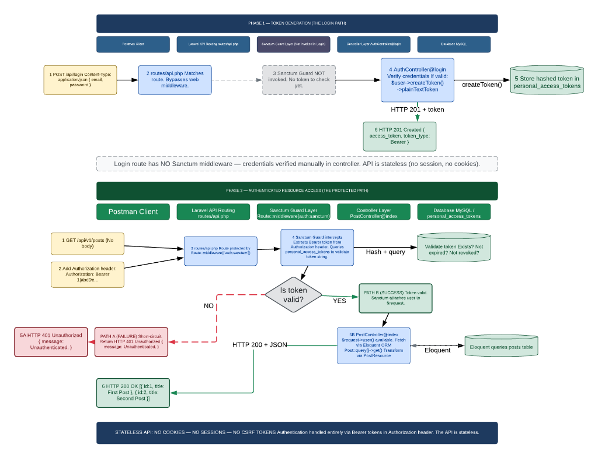

# 🧵 ThreadForge API

> A pure RESTful API built with **Laravel 13** that transforms raw technical content into optimized **X (Twitter)** posts using AI.

---

## 📋 Table of Contents

- [Overview](#overview)
- [Tech Stack](#tech-stack)
- [Architecture](#architecture)
- [Authentication Flow](#authentication-flow)
- [API Endpoints](#api-endpoints)
- [Project Structure](#project-structure)
- [Getting Started](#getting-started)
- [Running Tests](#running-tests)
- [Contributing](#contributing)
- [License](#license)

---

## Overview

ThreadForge API is a headless, stateless API designed to take raw technical content — blog posts, documentation, tutorials — and transform them into optimized X (Twitter) posts using an AI-powered ghostwriter agent.

**Key Capabilities:**

- 🔐 Token-based authentication via Laravel Sanctum
- 📝 Blueprint management for defining post generation rules
- ⚡ Async content repurposing with queued AI processing
- 🤖 AI-powered ghostwriter agent with tool-augmented generation
- 💬 Conversational AI chat interface for iterative refinement
- 🛡️ Policy-based authorization per resource

---

## Tech Stack

| Layer            | Technology                          |
|------------------|-------------------------------------|
| **Framework**    | Laravel 13                          |
| **Language**     | PHP 8.3+                            |
| **Auth**         | Laravel Sanctum (Bearer Tokens)     |
| **AI**           | Laravel AI                          |
| **Database**     | MySQL (Eloquent ORM)                |
| **Queue**        | Laravel Queue (database driver)     |
| **Testing**      | Pest 4                              |
| **Code Style**   | PSR-12 (Laravel Pint)               |
| **API Docs**     | Scribe                              |

---

## Architecture

This is a **headless API** — there are no Blade views, no web routes, and no frontend. All endpoints are defined in `routes/api.php` and every response is JSON.

```
app/
├── AI/
│   ├── Agents/           # AI agent definitions (GhostwriterAgent)
│   └── Tools/            # AI tools (GetCampaignRulesTool, GetPostHistoryTool)
├── Http/
│   ├── Controllers/Api/  # Thin controllers (Auth, Blueprint, Chat, GeneratedPost, RawContent)
│   ├── Requests/         # Form Request validation classes
│   └── Resources/        # API Resource transformers
├── Jobs/                 # Queued jobs (ProcessContentGeneration)
├── Models/               # Eloquent models (User, Blueprint, RawContent, GeneratedPost, Conversation, Message)
├── Policies/             # Authorization policies (Blueprint, Conversation, GeneratedPost)
└── Providers/            # Service providers
```

**Design Principles:**

- Controllers are kept thin — business logic lives in dedicated services and jobs
- All validation is handled exclusively through Form Requests
- API Resources control output — sensitive fields (`password`, `remember_token`, etc.) are never exposed
- Authorization is enforced via Policies

---

## Authentication Flow

ThreadForge uses **Laravel Sanctum** with stateless Bearer Token authentication. The API uses no cookies, no sessions, and no CSRF tokens.



**Phase 1 — Token Generation (Login):**
The client sends credentials to the login endpoint. The controller verifies them manually (no Sanctum middleware on login), creates a personal access token, and returns it to the client.

**Phase 2 — Authenticated Resource Access:**
For protected routes, the client sends the token in the `Authorization: Bearer <token>` header. Sanctum middleware intercepts the request, hashes the token, validates it against `personal_access_tokens`, and attaches the authenticated user to the request.

---

## API Endpoints

### Public

| Method | Endpoint              | Description          |
|--------|-----------------------|----------------------|
| POST   | `/api/auth/register`  | Register a new user  |
| POST   | `/api/auth/login`     | Login & receive token|

### Protected (requires `Authorization: Bearer <token>`)

#### Auth

| Method | Endpoint              | Description              |
|--------|-----------------------|--------------------------|
| POST   | `/api/auth/logout`    | Revoke current token     |
| GET    | `/api/auth/me`        | Get authenticated user   |

#### Blueprints

| Method | Endpoint                      | Description              |
|--------|-------------------------------|--------------------------|
| GET    | `/api/auth/blueprints`        | List all blueprints      |
| POST   | `/api/auth/blueprints`        | Create a blueprint       |
| GET    | `/api/auth/blueprints/{id}`   | Show a blueprint         |
| PUT    | `/api/auth/blueprints/{id}`   | Update a blueprint       |
| DELETE | `/api/auth/blueprints/{id}`   | Delete a blueprint       |

#### Content Repurposing

| Method | Endpoint                      | Description                           |
|--------|-------------------------------|---------------------------------------|
| POST   | `/api/content/repurpose`      | Submit raw content for AI processing  |

#### Generated Posts

| Method | Endpoint                          | Description                  |
|--------|-----------------------------------|------------------------------|
| GET    | `/api/posts`                      | List generated posts         |
| GET    | `/api/posts/{id}`                 | Show a generated post        |
| PATCH  | `/api/posts/{id}/status`          | Update post status           |

#### Chat (AI Conversations)

| Method | Endpoint                              | Description                    |
|--------|---------------------------------------|--------------------------------|
| POST   | `/api/chat/conversations`             | Start a new AI conversation    |
| POST   | `/api/chat/messages`                  | Send a message in conversation |
| GET    | `/api/chat/conversations/{id}`        | Get conversation history       |

---

## Project Structure

```
laravel-ThreadForge-api/
├── app/
│   ├── AI/
│   │   ├── Agents/GhostwriterAgent.php       # AI ghostwriter agent
│   │   └── Tools/                             # AI tools for agent augmentation
│   ├── Http/
│   │   ├── Controllers/Api/
│   │   │   ├── AuthController.php             # Register, login, logout, me
│   │   │   ├── BlueprintController.php        # CRUD for blueprints
│   │   │   ├── ChatController.php             # AI chat conversations
│   │   │   ├── GeneratedPostController.php    # View & manage generated posts
│   │   │   └── RawContentController.php       # Submit content for repurposing
│   │   ├── Requests/                          # 8 Form Request classes
│   │   └── Resources/                         # 5 API Resource transformers
│   ├── Jobs/
│   │   └── ProcessContentGeneration.php       # Async AI content processing
│   ├── Models/                                # 6 Eloquent models
│   └── Policies/                              # 3 authorization policies
├── database/
│   └── migrations/                            # 10 migration files
├── routes/
│   └── api.php                                # All API route definitions
├── tests/                                     # Pest test suite
├── composer.json
└── README.md
```

---

## Getting Started

### Prerequisites

- **PHP** >= 8.3
- **Composer** >= 2.x
- **MySQL** (or compatible database)
- **Node.js** >= 18.x (for Vite asset pipeline)

### Installation

```bash
# Clone the repository
git clone https://github.com/your-username/ThreadForge-API.git
cd ThreadForge-API

# Install dependencies
composer install
npm install

# Environment setup
cp .env.example .env
php artisan key:generate

# Configure your database in .env, then run migrations
php artisan migrate
```

### Running the Development Server

```bash
# Start all services (API server, queue worker, Vite)
composer dev
```

Or run individually:

```bash
# API server only
php artisan serve

# Queue worker (required for async AI processing)
php artisan queue:listen --tries=1
```

The API will be available at `http://localhost:8000/api`.

---

## Running Tests

This project uses **Pest 4** for testing.

```bash
# Run the full test suite
php artisan test

# Or via Composer
composer test
```

---

## API Response Format

All responses follow a consistent JSON structure.

**Success (200):**
```json
{
  "data": {
    "id": 1,
    "title": "How to use Laravel Sanctum",
    "status": "draft"
  }
}
```

**Validation Error (422):**
```json
{
  "message": "The email field is required.",
  "errors": {
    "email": ["The email field is required."]
  }
}
```

**Unauthorized (401):**
```json
{
  "message": "Unauthenticated."
}
```

---

## Contributing

1. Fork the repository
2. Create a feature branch (`git checkout -b feat/my-feature`)
3. Commit using [Conventional Commits](https://www.conventionalcommits.org/) (`feat(auth): add password reset`)
4. Push to the branch (`git push origin feat/my-feature`)
5. Open a Pull Request

---

## License

This project is open-sourced software licensed under the [MIT license](https://opensource.org/licenses/MIT).
